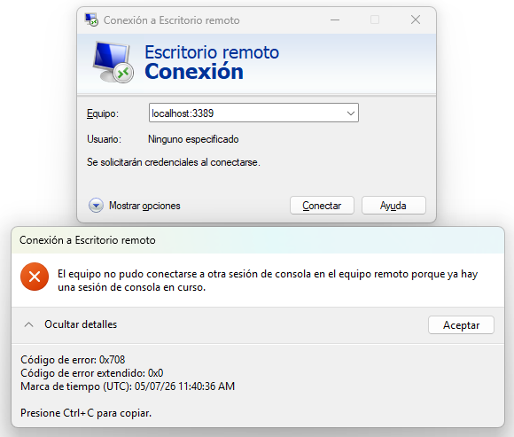
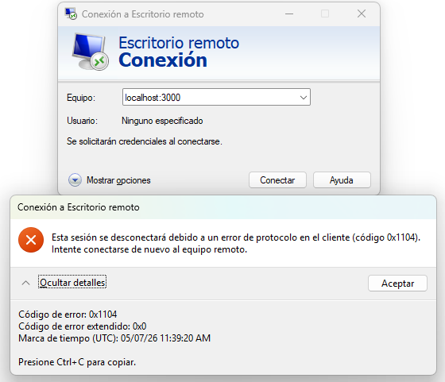
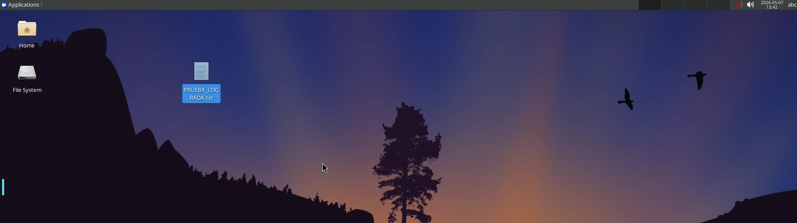

# **Bitácora Técnica 4: Gestión de Acceso Remoto Seguro (SSH/RDP)**

## **1\. Introducción y Objetivos**

Este repositorio contiene la documentación y los archivos de configuración para la **Bitácora Técnica 4** del módulo de **Sistemas Informáticos**. El objetivo principal es demostrar la capacidad de gestionar servidores de forma remota mediante protocolos seguros (SSH y RDP) utilizando una infraestructura ligera basada en contenedores **Docker**.

**RA Evaluado:** RA 6 \- Operar sistemas en red gestionando recursos e identificando restricciones de seguridad.

**CE Asociados:** 6.d, 6.e y 6.f.

## **2\. Infraestructura: Docker vs Virtualización Tradicional**

La verdad es que, tras algún tiempo usando máquinas virtuales pesadas, hemos optado por desplegar el laboratorio mediante **Docker Compose**. Esto nos garantiza:

* Un arranque casi instantáneo de los servicios.  
* Aislamiento de red controlado.  
* Evitar problemas de configuración de hardware específicos de cada equipo del alumnado.

## **3\. Diario de Despliegue y Resolución de Conflictos**

Durante la fase de pruebas, nos hemos encontrado con varios "misterios" técnicos que han enriquecido el aprendizaje que documentaremos a continuación.

### **3.1. SSH**

Al intentar la conexión inicial con ssh alumno@localhost \-p 2222, el sistema cerraba la conexión inmediatamente.

* **Problema 1 (IPv6):** El sistema intentaba conectar vía ::1 (IPv6), pero el contenedor solo escuchaba en IPv4.  
  * *Solución:* Forzar el uso de la pila IPv4 usando 127.0.0.1.  
* **Problema 2 (Mapeo de Puertos):** El servicio interno de la imagen linuxserver/openssh-server escucha por defecto en el puerto **2222**, no en el 22\.  
  * *Solución:* Corregir el archivo _docker-compose.yml_ para mapear explícitamente el puerto del anfitrión al puerto correcto del contenedor (2222:2222).

Realizamos correctamente:

* **Paso A (Conexión Inicial)**: Conéctate al contenedor usando ssh alumno@localhost -p 2222. La contraseña es sistemas_informaticos.
* **Paso B (Generación de Identidad)**: En tu máquina anfitriona, genera un par de llaves: ssh-keygen -t ed25519 -C "tu_correo@ejemplo.com"
* **Paso C (Transferencia)**: Copia tu llave pública al servidor. Puedes usar ssh-copy-id -p 2222 alumno@localhost o hacerlo manualmente pegando el contenido en ~/.ssh/authorized_keys dentro del contenedor.

: [Clave generada](assets/Key.png) :

### **3.2. RDP: Protocolos y Sesiones Fantasma**

Al probar el acceso gráfico, surgieron dos errores críticos que todo administrador debe conocer:

* **Error 0x1104 (Protocol Error):** Ocurrió al intentar conectar el cliente de Windows (MSTSC) al puerto **3000**.  
  * *Aprendizaje:* El puerto 3000 está reservado para el visor **HTTP/Web**. Los protocolos no son intercambiables; RDP debe ir por el 3389\.  
  ::
* **Error 0x708 (Sesión en curso):** Al tener abierta la sesión en el navegador y querer entrar simultáneamente por RDP nativo, el sistema bloqueó el acceso.  
::
  * *Aprendizaje:* Estos contenedores gestionan una **sesión de consola única**. No se puede "duplicar" el monitor virtual.  
  * *Solución:* Realizar un *Log Out* real en la sesión web o reiniciar el contenedor para liberar el recurso.

## **4\. Evidencias del Laboratorio**

### **Tareas Realizadas:**

1. Despliegue de servicios mediante docker-compose up \-d.  
2. Acceso exitoso vía SSH mediante par de llaves (Hardening).  
3. Configuración de sshd\_config para restringir accesos no deseados.  
4. Validación de acceso gráfico multiplataforma (Web y RDP nativo).

::

## **5\. Conclusiones**

La gestión remota es el pilar de la administración de sistemas moderna. Este laboratorio demuestra que no basta con que el servicio esté "corriendo"; es fundamental entender los mapeos de red, la jerarquía de puertos y la gestión de sesiones concurrentes para garantizar un entorno de trabajo funcional y seguro.
